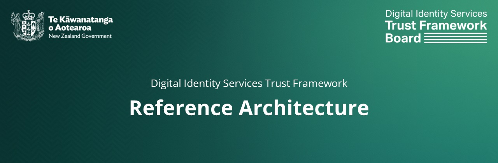

# New Zealand Digital Identity Services Trust Framework

>[!CAUTION]
>You are viewing the Reference Architecture **Exposure Draft**. It is intended for consultation only and does not represent government policy or endorsement by the Trust Framework Board.

## 3. Accessibility and Inclusion
The development of any digital identity or verifiable credential product must prioritise inclusion, ensuring it is usable by the widest possible range of people. Because identity acts as a gateway to essential services, exclusion can have significant consequences.

Not everyone has access to, or wishes to use, digital technology. Others may want to engage digitally but face barriers due to limited digital skills, inaccessible design, or systems that do not adequately reflect their disability, language, culture, or broader social and economic circumstances.

To respond to these challenges, the RA recommends that digital identity and verifiable credential solutions adopt a clear set of inclusion principles.

### 3.1 Accessibility and Inclusion Principles
#### 3.1.1 Apply Accessibility Standards
Any digital identity solution should be accessible; that is, usable by people with disabilities.
The Reference Architecture (RA) acknowledges that:
- New Zealand’s Human Rights Act 1993 prohibits discrimination based on disability in the provision of goods and services.
- New Zealand’s Bill of Rights Act 1990 legally compels the Government to adhere to the anti-discrimination requirements defined by the Human Rights Act in all its operations, policies, and legislation.
- New Zealand signed and ratified the United Nations Convention on the Rights of Persons with Disabilities (CRPD) in 2008, which obligates it to take appropriate measures to ensure and promote access for disabled people, on an equal basis with others, to information and communications technologies and systems.

To meet the above obligations, digital hardware, software and interfaces should conform to:
- [Web Content Accessibility Guidelines (WCAG) 2.2 at Level AA](https://www.w3.org/TR/WCAG22/).
- [NZ Government Web Accessibility Standard](https://www.digital.govt.nz/standards-and-guidance/nz-government-web-standards).

#### 3.1.2 Ensure compatibility with Assistive Technologies
Assistive technologies are tools that help disabled people access and interact with information and environments. Examples include screen readers, voice recognition software, alternative keyboards, and hearing aids. 

WCAG addresses many of the issues with digital access that disabled people experience. However, to ensure real-world interoperability with assistive technologies: 
- Enable accessibility features in web-based and native mobile apps, and ensure that any digital identity solution does not lock out people who use assistive technologies.

#### 3.1.3 Support Non-Digital Pathways
New Zealanders need options to communicate and access services through non-digital channels where digital identities are required.

This means all accredited parties must ensure:
- Non-digital pathways are available for enrolling in, verifying, and revoking digital identities for both potential and existing users. These options need to be communicated at the point where digital functions are made available by the credential issuer and/or facilitation service provider.
- Customer feedback loops include non-digital options (for example, over-the-counter support from the issuer). These options should also be displayed in the facilitation service UI wherever digital feedback is requested.

Please also note:
- Email and SMS are discouraged as primary engagement channels for providing or removing digital identity services, because phishing commonly uses these channels.
- In-app messaging is preferred for feedback loops, where appropriate authentication can confirm both service provider and user identity. However, non-digital channels such as over-the-counter and voice options (with appropriate security controls) should also be available.
- As set out in legislation, digital identity is opt-in and not mandatory.

#### 3.1.4 No Data Collected on Channel Preference or Personal Characteristics
To ensure there is no bias in the way services engage with parties without a digital identity, there will be no data and metadata collected on:
- Information related to personal characteristics such as sex, age, language, ethnicity, or disability bound to an identity, unless collection is required under a legal, legislative, or regulatory requirement (for example, disability parking credentials or NZ Super eligibility) and is consistent with Privacy Act requirements.
- Choices or preferences for digital or non-digital credentials, unless collection is legally permissible.

#### 3.1.5 Provide Multilingual Support
Language barriers can create significant issues. Supporting multiple languages ensures equitable access for culturally and linguistically diverse communities. To account for this:
- Provide interfaces, customer engagement, guidance, and help resources in multiple languages, including New Zealand’s official languages (te reo Māori and NZSL) and other commonly used community languages.

#### 3.1.6 Physical Equivalents of Digital Credentials
Inclusion also means accommodating people without reliable internet, devices, or digital literacy. Physical options prevent exclusion from essential services:
- Offer secure, physical alternatives to digital credentials (for example, ISO/IEC-compliant smart chips that do not require power or a mobile phone) for individuals who cannot, or choose not to, use digital channels.

#### 3.1.7 Plain Language
While this may appear straightforward, digital services frequently use technical, legal, or domain-specific language. The use of plain language supports broader understanding of how a service operates and what is expected of users.

Plain language should be applied, and specialised terminology avoided, in the following situations:

- Explaining the rights and obligations of the user. For example, in a privacy statement or privacy impact assessment, it must be clear:
  - what the user is expected to do  
  - how their data will be used  
  - what rights they have in relation to their data  
  - what data will be collected and how long it will be retained  
- Providing clear eligibility criteria for enrolling in, revoking, or accessing a service.
- Ensuring that any images provided are supported with text alternatives so that non-visual users and assistive technologies can understand and interpret the instructions.
- Giving simple, direct guidance when issues occur, including how to get support.
- Offering alternative approaches when mobility is required during onboarding. For example, biometric liveness testing should include audio or text instructions, and accessible alternatives must be available for people who cannot complete the required movement due to disability or other reasons.

Technology can contain biases. It is important that all participants in the ecosystem understand these limitations in clear and easy terms as part of an accessibility and inclusion by design approach. The business processes that support people engaging with the digital identity ecosystem are equally important to ensure an inclusive, fair, safe, and accessible environment.

#### 3.1.8 Continual Testing, Improvement and Monitoring
Inclusion and accessibility cannot be fully achieved without lived experience informing decisions. Standards and technologies evolve, and user needs change over time. To ensure that digital identity solutions will continue to meet the needs of real people over time:
- Involve people from different communities, especially the disability community and different age, cultural, and linguistic groups, in design, testing, and governance.
- Establish ongoing accessibility and usability audits and feedback loops.

[<< 2. New Zealand's Digital Identity Ecosystem](2-ECOSYSTEM.md) | **3. Accessibility and Inclusion** | [4. Privacy >>](4-PRIVACY.md)
