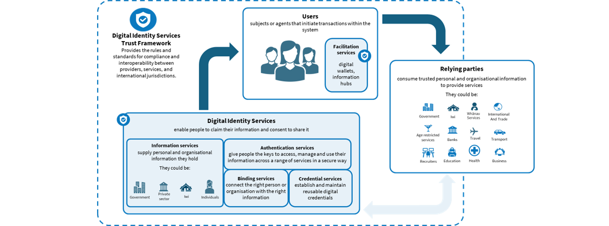
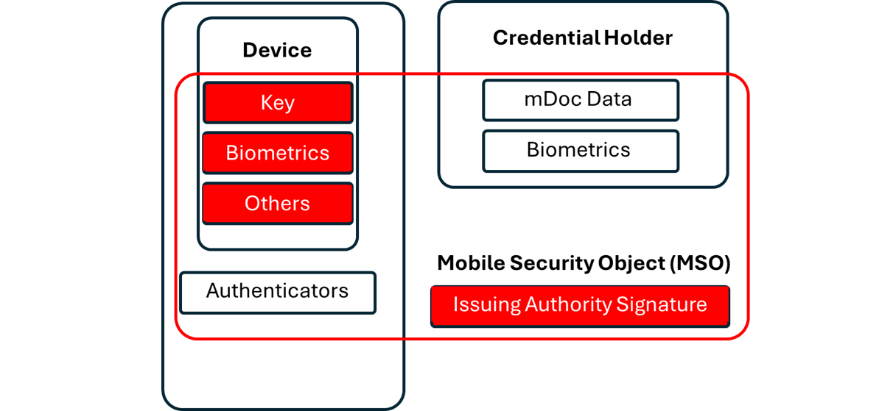

# New Zealand Digital Identity Services Trust Framework

>[!CAUTION]
>You are viewing the Reference Architecture **Exposure Draft**. It is intended for consultation only and does not represent government policy or endorsement by the Trust Framework Board.

## 5. Digital Identity Ecosystem Roles

### 5.1 Overview

The Digital Identity Ecosystem in New Zealand is underpinned by the Digital Identity Services Trust Framework Act 2023. The legislation identifies two administering bodies:

- **Trust Framework Board (TFB)**: Drafts the rules and regulations for ministerial consideration. The TFB is supported by the ministerially appointed Māori Advisory Group, which advises the TFB on Māori interests and knowledge as they relate to the operation of the trust framework.
      
- **Trust Framework Authority (TFA)**: Responsible for enforcing the Digital Identity Services Trust Framework (DISTF). The Authority may also seek advice from the Privacy Commissioner on:
    - Whether the applicant for accreditation is or has been the subject of a formal investigation or proceeding by or taken by the Privacy Commissioner; and
    - the status or outcome of any such investigation or proceeding.
      
The TFA is considered the regulator in this Reference Architecture (RA).

Section 17 of the DISTF states that nothing in the Act overrides the Privacy Act 2020. Therefore, the Act and its participants are subject to the Privacy Act and three key enforcement bodies identified as roles in that Act:
  - Office of the Privacy Commissioner (OPC)
  - Director of Human Rights Proceedings
  - Human Rights Tribunal

The DISTF outlines three participants:
-  Users
-  Trust Framework (TF) providers; and
-  Relying Parties

### 5.2 Users

Under the DISTF a **user** means an individual who:
-  shares personal or organisational information, in a transaction with a relying party, through one or more accredited digital identity services; and
-  does so for themselves or on behalf of another individual or an organisation.

Sections of the RA that focus on supporting users are:
-  Section 3.0 Accessibility and Inclusion
-  Section 3.2 Te ao Māori Approaches to Identity
-  Section 4.0 Privacy
-  Section 4.2.1 Selective Disclosure
-  Section 4.7 Breach Reporting
-  Section 6.0 Level of Assurance

### 5.3 Trust Framework Providers

**TF providers** may provide both accredited and non-accredited services. The Digital Identity Services Trust Framework Regulations 2024 identify the following service types:
-  Information services
-  Binding services
-  Authentication services
- Credential services
- Facilitation services

These service types are referenced through this reference architecture and are detailed below.

### 5.4 Relying Party

Under the DISTF Regulations, a relying party is an individual or an organisation that relies on personal or organisational information shared, in a transaction with a user, through one or more accredited digital identity services.

Additionally, under the RA, where relying parties seek personally identifiable information (PII) and store it for any purpose, they will require the verifying service being used to provide the user with a privacy statement that:
-  authenticates that the relying party is who they say they are
-  states why the information is being collected
-  states which PII is being stored
-  states what is shared with third parties
-  states the required retention period for the data
-  states whether the data is shared with any other third parties (and with whom)

## 5.5 Digital Identity Service Types

### 5.5.1 Information Services
Under the DISTF Rules, an information service means a digital identity service that provides:
-  personal or organisational information; and
-  a level of assurance as to the accuracy of that information

Examples of information service providers include (but are not limited to):
-	Government
-	Private sector organisations
-	Iwi
-	Individuals

An information service provider generally holds the source information (for example, a system of record) or master data for the digital credential holder/user. This may also include biometric and biographic sources. They may already have existing information management, security, and other regulatory requirements for protecting and managing personal information. An information service can be used to provide attributes to multiple credentials, with a level of information assurance that indicates the level of confidence a relying party can place in that information.

### 5.5.2 Binding Services
A binding service, under the DISTF Regulations, is a digital identity service that links a person or organisation to their verified entity information. Binding is not a one‑off process, it can occur multiple times throughout the life of a digital credential.

Binding confirms that the data and attributes associated with an entity are accurate and trusted because they are cryptographically signed by the Issuing Authority and linked to the device presenting the credential via the device key.

Binding may be applied at enrolment and re‑applied as needed, for example when:
-	Entity information becomes “orphaned” (e.g., loss of all authenticators, or an enrolment where no initial binding occurred such as a birth record or unassigned stored‑value card)
-	New authenticators are added
-	The level of assurance needs to be increased
-	Entity information is suspected to be compromised

This ensures the entity’s data remains trustworthy and properly anchored throughout the credential’s lifecycle.

Binding has specific controls to ensure data integrity, and these are further specified in the Binding Assurance Standards. Note that binding services need to apply cryptographic requirements to ensure that biometric data and bound data elements provide non-repudiation.

All these binding elements focus on ensuring that entity attributes (for example, for individuals, businesses, and assets) maintain integrity and can be trusted.

#### 5.5.2.1 Biometric Matching and Binding

Biometric matching refers to the process of matching stored physical characteristics with those presented either online or in person at a point in time.  This could be for instance comparing your image just taken to a stored image by either the digital credential and/or biometrics stored by the Information Service provider.

Biometric binding is when there is a positive biometric match and that confirmation is cryptographically linked to an identity and the connected attributes of that individual.

For the purposes of this RA, biometric binding refers to binding an individual’s image and, where applicable, liveness testing of the image taken as part of the proofing process. As other biometric methods become standardised for binding, the RA will include them.

Note also that biometric matching can be used as an authentication factor (refer to 5.5.4 Authentication Service).

New Zealand has an existing Biometric Processing Privacy Code (2025) and this covers, collection, use, disclosure, requests by owner, storage, security, retention and disposal.

#### 5.5.2.2 Credential Matching and Binding

>[!WARNING]
>[Editor's note] This section needs work to better align it with the NZIS section on using authenticators for binding.

Credential matching is based on a user matching the data they have from an existing credential and providing that data to match with either a credential service provider or Issuer’s Information Service, system of record.  The matching provides evidence that the user has the data available to conduct the match.

Credential binding occurs when there is a positive match of the data provided by the user to the Information Service, system of record (either directly or by the credential service provider) and that confirmation is cryptographically linked between the credential being issued or updated with the data from the issuer’s system of record.

#### 5.5.2.3 Smart Chip Binding

>[!WARNING]
>[Editor's note] We need to fill this out in order to reflect the current status.

### 5.5.3 Credential Services
A credential service under the DISTF Regulations is a digital identity service that creates a standards-based, reusable credential. 

For the purposes of this RA, creating a reusable credential refers to services that create verifiable and derived credentials that comply with ISO/IEC 18013-5 (Personal identification — ISO-compliant driving licence) and ISO/IEC 23220-2 (Data objects and encoding rules for generic eID systems).

A credential service may utilise shared technology, such as a credential broker or issuance platform, to enable issuing, updating, and revocation of its own digital credentials. The All-of-Government Credential Issuance platform is a clear example in which multiple credential services (with separate cryptographic keys) utilise shared infrastructure.

In this RA, a credential refers to a verifiable credential: cryptographically secured data that represents an entity, individual, or object, along with other relevant data for verification and transactions. This can represent trusted digital instances of physical documents, such as a driver licence or photo ID, as well as assets (vehicle registration) or financial products (grants and rebates). These can be cryptographically verified and bound to the issuer/information service and credential service provider. Examples of other verifiable credentials include:
-  Micro-credentials: Where a Primary Issuer of a credential provides a subset of credentials such as course certificates or awards.  Seen primarily in the education sector where short courses or part qualifications can be earned without completing or receiving full course/certificate or degree.
-  Ephemeral credentials: These are short lived credentials, either derived or issued to provide temporary access or to complete a minimum set of transactions.  Examples could be tickets to an event, or temporary access to a rental vehicle.
-  Derived credentials: Where a credential is derived from another credential and retains some of the security features of the original credential. That primary credential can be used as a trust anchor to either create a copy (though this can result in lower assurance, depending on how binding to the original source is undertaken) or to spawn a micro-credential or ephemeral credential without necessarily undertaking the pre-auth enrolment that a primary issuer would undertake. For an example, see Section 9.X.X ICAO 9303 Derived Credentials.

>[!WARNING]
>[Editor's note] Definition of derived credential to come.

### 5.5.3.1 Device-Credential Binding
Under the ISO/IEC Standards, Credentials established in a Digital Wallet are device bound.  This typically means the digital credential stored in one wallet cannot be transferred by the user or any other service provider into another device and/or wallet.  Each instance of that digital credential is unique per device.

An issuer may choose to allow a credential for a user to exist in multiple devices, for instance, a smartphone, smartwatch, table or other wearable smart device. However, each instance of that credential is cryptographically uniquely identified per device.  

Device-credential binding occurs at enrolment following entity binding and the mDoc (mobile Document) and the Mobile Security Object (MSO) are being prepared (known as document preparation). The credential is bound when it is cryptographically linked to the device that the credential was enrolled into, in conjunction with the Issuing Authority cryptographic signature.

Note, device binding is only available on mobile devices that have secure elements/enclaves. This means that there may be issues on older phones and operating systems and devices that don't contain these secure elements, like tablets.

### 5.5.4 Authentication Service

An **authentication service** is a digital identity service that enables a person to use an authenticator to access a service.

Importantly, an authentication service requires both:
-  use of one or more authenticators; and
-  management of the authenticator lifecycle.

For example, an authentication service might utilise a PIN code as the authenticator to restrict access to a digital wallet. But the service, in managing the authenticator lifecycle, also needs to consider and manage factors like:
-  how often the PIN code needs to be changed.
-  the minimum length and complexity of the PIN code.
-  how to manage repeated incorrect attempts at the PIN code; and
-  ensuring the user is aware of their responsibilities regarding managing the authenticator.

For implementation advice for an authentication service, refer to the New Zealand Identification Standards: Implementing the Authentication Assurance Standard.

#### 5.5.4.1 Recommended Sets of Authenticators

There are practical reasons to use a set of authenticators, including limitations in an organisation’s access to technology. Some authenticators can also cause inclusion or accessibility issues. Therefore, the use of authenticators needs to consider:
-	Risk and security postures (as the stronger these are, usability and accessibility will form part of the compromise)
-	Use case and the customer experience required
-	Existing technologies employed (as the best authenticators may be compromised if back-end systems are poor)
-	Overall level of assurance required to deliver a service.

However, there are global trends that indicate certain types of authenticators are a vector and focus for fraudulent activities:
-	Password- and PIN-based systems
-	Use of SMS and email as out-of-band additional authenticators (a primary phishing target)
-	Facial biometrics (where your face is your password but is also present on social media). Note that biometrics are not generally considered a standalone authenticator because they are probabilistic.

Each of the above systems has mitigations, and facial biometrics with liveness and other capabilities can reduce some of that risk. However, with the rise of AI and deepfakes, authenticators will need to continually evolve.

As such the RA recommends a combination of several methods as authenticators:
-	Cryptographic multifactor one-time password (OTP) (Section 5.5.4.6 Multi-Factor OTP Authenticators)
    -	Hardware protected Authenticator with activation factor
    -	Use of Passkeys as a primary authenticator, access to which is protected by an on-device authenticator or biometric verification bound to the key.
-	Use of a verifiable credential as part of authentication (subject to adoption).
-	Any out-of-band authenticators used in app messaging and authentication, provided the app itself has a minimum level of authentication, biometric verification for access, and binding to the user.
-	Over the counter recovery processes to provide out of band fraud recovery

#### 5.5.4.2 Passwords

_Something you know_

A secret value chosen or memorised by the user. There are minimum password standards to provide strength, but passwords are not phishing-resistant. This could be a personal identification number (PIN), passphrase, or combination. Password-based authentication relies on matching previously agreed secrets stored by the identity provider.

#### 5.5.4.3 Look-up Secrets

_Something you have_

A pre-generated set of secret values issued to the subscriber at enrolment or during a transaction with the issuer (known as a Credential Service Provider [CSP] in NIST standards), to be used by the user to authenticate.

The two roles involved are:
- Look-up secret authenticators: There are two parties involved — the issuer of the look-up secret, which provides the range of one-off secrets, and the presenter of that secret (the user).
- Look-up secret verifiers: These prompt the user for a one-off secret and ensure that the one-use secret is no longer reusable.

#### 5.5.4.4 Out-of-band Devices

_Something you have_

This is where the user has a physical device that communicates with the verifier over a secondary channel, independent from the primary authentication channel. Out-of-band (OoB) authentication uses a short-term secret generated by the verifier.

The physical device is used to generate a short-term, one-time-use secret in the secondary channel. When that secret is presented and successfully verified in the primary channel, it provides a binding between the primary and secondary channels.

Four primary examples of Out-of-band devices are:
-	Phone call verification: Where the secret/pin is entered on the phone (sometimes with a # to indicate completion)
-	SMS One Time Password (OTP):  Where a one-time code is sent to the user via text.  Then that one-time password is entered into a verifier
-	Push Notification to Authenticator App:  An example is where your actual Authenticator or App seeks to approve or confirm that you have instigated or completed a transaction, and you seek to approve or deny.  Please note this is not the actual cryptographic secret provided by the Authenticator App itself.
-	Hardware token (on a separate channel, for example not on the mobile device being used to authenticate): This is where there is a dedicated token that generates a random code or cryptographic response.

| Example                   | Primary Channel   | Out of Band Secondary |
|---------------------------|-------------------|------------------------|
| SMS OTP                   | Internet          | Cellular network       |
| Voice call verification   | Internet          | Telephone network      |
| Authenticator app push    | Browser session   | Secure app connection  |
| Hardware token            | Computer          | Physical device        |
| Mobile app challenge      | Web               | Mobile device          |

**Multifactor Out-of-Band Authenticators**

_Something you have + another presentation factor_

This is where another presentation factor (for example biometric matching or password) is required before completing a transaction with an out-of-band authenticator, based on verification of that presentation factor. None of the presentation factors are stored after authentication is complete.

#### 5.5.4.5 Single-Factor One-Time-Password (OTP)
_Something you have_
This is where either hardware or software generates a randomly generated one-time password. These authenticators have an embedded secret that is used to generate the OTP. There is no second factor used to activate the OTP (unlike multifactor OoB). While the presentation is similar to look-up secret authenticators, they differ in that the secret is developed independently of either the authenticator or issuer/verifier through a cryptographic method. OTP authentication is also not considered phishing-resistant.

#### 5.5.4.6 Multi-Factor OTP Authenticators
_Something you have + Presentation of another activation factor_
Recommended: Multi-factor cryptographic authentication using passkeys.
This includes an OTP, but also requires presentation of an activation factor (for example biometric or password) before obtaining the OTP from the authenticator. Two other requirements are:
-  A symmetric key that persists for the authenticator’s lifetime; and
-  A nonce that is changed each time the authenticator is used or seeded by a real-time clock.
The following are examples of other activation factors:

| Category                   | Factors               | Key Storage                     | Typical Use                 | Phishing Resistance                                            |
|----------------------------|------------------------|----------------------------------|-----------------------------|----------------------------------------------------------------|
| Single-Factor Cryptographic | “Something you have”   | Local or hardware-protected      | Device key, hardware token  | Yes, if it meets NIST SP800-63B-4 (Sec 3.2.5)                 |
| Multi-Factor Cryptographic  | “Have” + “Know/Are”    | Hardware-protected with activation factor | Passkey, smart card, wallet | Yes (if signed and bound)                                     |
| Subscriber Wallets          | “Have” + “Know/Are”    | Local wallet on device           | Digital ID wallets          | Yes (if audience-restricted)                                  |
| Syncable Authenticators     | “Have” (optional extra) | Syncable via cloud               | Passkeys synced across devices | Conditional, per NIST SP800-63B-4 Appendix B                 |

#### 5.5.4.7 Biometric Authenticators

_Something you are_

Biometrics is the automated recognition of individuals based on biological and behavioural characteristics. While the most common are facial and fingerprints, other cases of biometric matching include:
-	Voice patterns
-	Gait
-	Iris scanning
-	Retina scanning
-	Typing speed
-	Keystroke patterns, screen pressure

While biometrics are considered an authentication factor under the New Zealand Identification Standards, in some jurisdictions they are not considered a separate factor because the “secret” (such as a person’s face) is publicly observable, and advances in AI-driven cloning significantly increase the risk of misuse. While Presentation Attack Detection (PAD) technologies can reduce these risks, they remain probabilistic and therefore only add assurance when combined with other authentication factors. Biometrics themselves are inherently probabilistic rather than deterministic.

Biometrics may also be applied actively, where the user is explicitly aware that biometric collection and matching are occurring, or passively, where the user is not aware. The Trust Framework does not support the passive use or collection of biometric information.

Under the Trust Framework's proposed Levels of Assurance (which are provisional and subject to regulatory change) a “plus” can be added to an existing Level of Assurance to indicate enhanced biometric assurance. For example, if a credential is issued at a "Standard" level of assurance, undertaking biometric matching at the point of binding can increase it to "Standard+".

#### 5.5.4.8 Pre-Authorisation (Pre-Auth)
Often in the digital credential space, a user is redeeming a credential that has already been authorised. The pre-authorisation flow, as defined in OpenID 4 Verifiable Credential Issuance, allows a user to redeem a generated credential following authorisation (for instance, because this has been done in person).

Typically, this is:
-	Initiated by the issuer who generates a pre-authorisation code after identity proofing
-	This is shared via an online link or QR Code that the user scans or clicks
-	This method then is accompanied by some level of authentication, “out-of-band” using one of the above authentication methods
-	When confirmed a new verifiable credential is enrolled and instantiated in the new wallet or facilitation service

If there is an airgap between the pre-authorisation sessions, there are potential risks.

>[!WARNING]
>[Editor's note] Awaiting some clarity around treatment of Pre-Auth for Levels of Assurance.

### 5.5.5	Facilitation Service
Under the Digital Identity Services Regulations, a facilitation service means a digital identity service that enables a person to present a credential to a relying party either online or in person. This typically takes the form of a digital wallet. With agentic AI in future, “vaults” that contain digital credentials may also be possible.

Under the Trust Framework, a federated identity "hub" or "IdP" that provides an account-based authentication service as its primary means to represent a digital identity is not a facilitation service, but may be an authentication service.

A digital wallet can be presented both online and in person, and a facilitation service can support one or both methods (preferably both for inclusion).

## 5.6 The role of the Government App/Digital Wallet

The Government Chief Digital Officer has developed an app that will improve the way New Zealanders interact with government. The government app will provide a:


-    secure way for agencies to communicate with New Zealanders
-    safe digital wallet to hold accredited digital credentials
-    a direct way to access government services and make payments.

The app will prioritise usability, security and privacy for all users and will always be optional to use.

The app will hold digital credentials accredited under the Digital Identity Services Trust Framework. This will include credentials from government agencies and accredited private sector providers – for example, a digital driver’s licence.

The app will seek accreditation under the DISTF as an authentication service and as a facilitation service.



As such, it is expected that the Government App, and its digital wallet functionality, will play an important role in the development of New Zealand's digital identity ecosystem.

>Note: The introduction of an accredited digital wallet by the government does not preclude other digital wallet providers from entering the market, seeking accreditation, and holding accredited credentials, including those issued by government.

Cryptography is the underlying trust fabric of the decentralised ecosystem. The building blocks of cryptographic trust are:
-	**Cryptographic keys**, where:
        -	The public key is distributed by the digital certificate.
        - Relying parties/verifiers and wallets can also use cryptographic keys (for example, TLS) to secure channels at the point of data exchange between holder and verifier.
        - Cryptographic key pairs are used as a means of authentication between devices, actors, and products in a Public Key Infrastructure (PKI) ecosystem.

-	A **digital signature** is used to sign the certificate and bind the issuer to credentials and the attributes within the certificate.
The combination of these components enables encryption, secure binding of data to issuers, and authentication.

Each service provider in the PKI ecosystem has a role to play in the digital identity and verifiable credential ecosystem.
-    The **information service** is the primary assurance provider. It uses cryptographic platform capability to provide keys and signatures to devices, wallets, credential holders, or relying parties. These keys form the root of trust for the credential and the identity proved within it.
-    The **credential service** provides document preparation for the verifiable credential and ensures that both the data attributes and the credential itself are signed by the appropriate providers. It is therefore also critical in managing binding for a credential.

-    The **facilitation service** provides the device cryptographic keys that are bound to the document. Through interactions between the credential service provider and relying party, it enables customers to selectively disclose signed data and ensures receipts in the customer transaction log are protected and digitally signed.
-	The **relying party/verification service** will have physical and/or online devices with digital signatures to prove those devices can be trusted. When personal information is collected, those signatures are used to sign the data to ensure accountability and privacy protection.
-	The **trust service provider** hosts the public keys of all parties participating in the PKI system, allowing relying parties and users to match public keys across the ecosystem.

-	The **authentication service**, depending on the architecture (centralised or decentralised), may have encrypted tokens sent between different providers. It will also encrypt and sign the transport layer using mutual transport layer security (mTLS).
-	The **binding service** in a verifiable credential architecture is undertaken primarily through the credential service. However, in a hybrid or federated ecosystem, an identity service provider (IDP) may also sign the JWT and attributes instantiated in the IDP or single sign-on (SSO) platform through a pre-auth flow or enrolment.
This is why PKI provides the end-to-end trust fabric of a digital identity and verifiable credential ecosystem. How those keys are instantiated through to disposal (lifecycle managed) determines levels of assurance, depending on the practices (people, process, technology) applied in each role. Refer to Section 7.0 Trust Model for more details.

[<< 4. Privacy](4-PRIVACY.md) | **5. Ecosystem Roles** | [6. Levels of Assurance >>](6-LOA.md)
