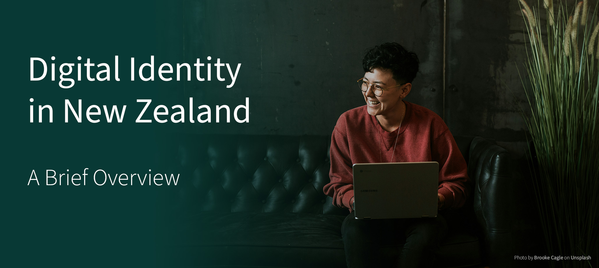
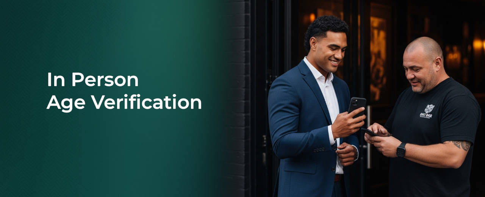

## Executive Summary
This paper explores the evolution and application of digital identity in New Zealand, addressing the need for secure, privacy-preserving, and user-centric solutions for sharing personal and organisational information in a digital age. It highlights the limitations of traditional systems reliant on physical documents or centralised digital platforms and introduces decentralised (or self-sovereign) digital identity as a transformative alternative.

Decentralised digital identity empowers individuals and organisations by allowing them to control information about them through digital credentials stored in digital wallets. These credentials can include various data points such as identification, qualifications, and financial details, and they enable users to share information securely and selectively. The paper outlines how this approach enhances privacy and security while reducing the risks of identity fraud, data breaches, and inefficiencies in traditional identity verification processes.

The introduction of the Digital Identity Services Trust Framework Act 2023 marks a significant milestone for New Zealand, providing a formal structure for accrediting digital identity services. This framework establishes trust across a decentralised ecosystem by defining standards for issuers and wallets. Accreditation ensures compliance with stringent security, privacy, and identification management standards, fostering confidence among users and service providers alike.

Through illustrative use cases, such as Sam using a digital driver licence for age verification and Helen streamlining business banking with digital credentials, the paper demonstrates the practical benefits of decentralised digital identity. These examples showcase the flexibility of the system in both online and in-person scenarios, empowering users to interact securely and efficiently across different contexts.

A mature digital identity environment offers significant economic and productivity benefits too, potentially amounting to billions of dollars annually. It enables instant, secure online identity verification—dramatically reducing the time and cost of in-person checks across both public and private sectors—and improves government efficiency, particularly during crises. Digital identity also mitigates fraud and scams through stronger verification protocols, addressing issues that cost New Zealanders an estimated $2.3 billion each year. International modelling reinforces the economic value, with projected gains ranging from $2.1b to over $12b annually based on comparable jurisdictions such as the UK, Australia, and Canada.

Finally, the paper addresses challenges such as misinformation and emphasises the importance of public education on the benefits and safeguards of digital identity services. It underscores that participation is voluntary, user privacy is paramount, and the framework enables greater control and convenience for individuals.

The development of decentralised digital identity in New Zealand represents a significant step towards a more secure, interoperable, and user-centric identity ecosystem, aligning with global standards and technology and consumer expectations for modern, digital-first solutions.

## Digital Identity in New Zealand

### Background

Sharing information in a variety of forms has been commonplace for hundreds if not thousands of years. From tribal tattoos and markings, through letters of introduction, to official certificates of birth marriage or qualification. All these approaches, and many others, have methods built in to allow the recipient to identify who created the information and decide if they would trust it. 

All these methods have one thing in common: they need to be physically inspected by someone who knows what they are looking for to determine their authenticity. While internet technology has advanced across many areas of society in recent years, it did not provide an alternative approach to trusted information sharing in its initial design.

> "The internet was built without an identity layer"
> 
> *Kim Cameron, former Chief Architect of Identity, Microsoft*

Through the boom of dotnet companies and the rise of more transactional services (often referred to as Web 2.0), many organisations looked to the internet to provide faster, easier, more cost-effective ways to reach their customers. While accessing services over the internet for existing customers was relatively easy, onboarding new customers was challenging as it still required people to visit a physical location to have documents and additional evidence viewed and recorded.

For over two decades, tech giants, entrepreneurs, standards bodies, and governments across the globe have been trying to replicate the trust mechanisms of physical documents in the digital world. This has produced a wide range of commercial solutions based on proprietary technology that have pushed for market dominance. In recent years, standards bodies such as ISO, NIST, IETF, W3C, and the Open ID Foundation have been developing new, open standards to codify the technology and processes of trusted information sharing in a digital world.

At the same time there has been an arms race between cyber security professionals and hackers. The current processes of gathering identification documents and other evidence and recording this digitally creates a treasure trove for hackers to trawl through if they get access. The security of information can never be completely assured.

This issue is exacerbated by poor identification practice. Organisations offering digital onboarding processes may do a reasonable job of verifying that the information they receive during onboarding is correct and has come from a legitimate source. However, they often do a poor job of verifying the information belongs to the actual person sitting behind the keyboard. This creates a gap for hackers to steal someone else’s legitimate identification information and use it to create new accounts elsewhere, often for financial gain.

As a result, people find it hard to share information about themselves online in a secure, trusted, and efficient manner. This can be attributed to two key reasons: lack of access to their information in a digitised format, and lack of suitable solutions to manage and share their information. For example, much personal information is held by public and private organisations, with specific control, access, and use requirements. It can often be reused, but the processes are not user centric. 

A third reason it is not easy to share information and the systems that support sharing between organisations, and between government and the private sector do not currently easily support interoperability and reusability.

At the same time, the proliferation of contactless pay and digital payment wallets has led to changing consumer preferences. Increasingly, consumers want the option to go “wallet-less” and rely instead on digital wallets on their smartphone or smartwatch. Just as digital payments have eased the online process, so too are consumers finding digital payments are easing in-person transactions. This is creating a growing expectation that forms of digital identity are made available on smart devices that work just as easily for in-person transactions as they do for online ones.

People need to share their information, but the lack of easy, safe, and secure ways to do that online and in-person can lead to greater risks of privacy breaches, identity fraud and cybercrime as well as frustration and friction for users and the relying parties with whom they wish to share their information.

### Decentralised (or Self-Soverign) Digital Identity

Technological advancements, inspired by blockchain and other distributed ledger technologies, led to the emergence of new forms of digital identity during the mid-2010s. These innovations eliminate the need for a central or federated identity provider (like RealMe) to act as a constant intermediary.

Decentralised (or Self-Sovereign) Digital Identity empowers individuals by giving them exclusive control over their identity documents and personal data. Instead of relying on a central authority to manage this information, individuals can securely store digital credentials in a digital wallet. These credentials may include identity data such as a driving licence, qualifications, employment history, or financial details.

With this approach, individuals decide when and with whom to share their data, enhancing privacy and security. This flexibility applies to both in-person and online interactions, such as signing up for services or making age-verified purchases. Importantly, decentralised systems ensure that issuers cannot track when or where a user presents their digital credential, a significant improvement over centralised or federated systems. At the same time, the relying party can be assured that the credential was issued by the legitimate issuer and has not been tampered with.

Importantly, a digital credential is verifiable, enabling the relying party to independently confirm a credential's authenticity without involving the issuer.

In essence, decentralised digital identity with digital credentials is a "back to the future" approach, replicating the trusted credential model of physical documents but with enhanced features in a digital format.

*Diagram 1: the “trust triangle” showing an issuer providing a credential to a user, who then chooses who and when to share it with a relying party.*

The above diagram demonstrates the basic model on which a user enrols with an issuer, an issuer creates and issues a digital credential to the user, and then the user can present the information from that credential to a relying party who can rely on the validity of the information.

Consider the example of a digital (or mobile) driver licence in use.

Jane Doe (User) enrols with the state transport agency (Issuer) to prove she is who she proports to be. Jane already has a physical driver licence and uses this to demonstrate to the transport agency that she is Jane. The state transport agency then issues her a copy of her driver licence in a digital form (the Credential Issuance) to a digital wallet she already has installed on her smartphone. She only needs to do this once.

A few days later, Jane wants to rent a car. She logs in to the rental car company’s (Relying Party) website (Verifier) and proves who she is and that she can drive using her digital driver licence. The next day she goes into the rental car company store and again provides her digital driver licence, but this time she presents it in person to the attendee who has a verifier app on their phone.

Both online and in person, the rental car company has verified her digital driver licence by checking it’s correctly signed and was issued by the state transport agency. But at no point was the state transport agency notified or alerted that Jane was using the digital credential they issued to her. Further, Jane can reuse the digital driver licence as often as she likes. She would only need to re-enrol and have the credential re-issued if she lost her phone or when the licence expires.

## New Opportunities

The example above represents just one possibility, based on an existing physical credential. Now imagine a broader scenario where any public agency, private company, iwi, or NGO could act as an issuer of identity and other assured information for users. These credentials could encompass a wide range of possibilities, including but not limited to:

*  **Personal Identification**: Digital versions of government-issued IDs such as passports, driver's licences, and national identity cards.
*  **Educational Qualifications**: Certificates and diplomas from educational institutions, including degrees, professional certifications, and course completions.
*  **Iwi Affiliation**: credentials denoting iwi and hapu affiliation issued by the iwi.
*  **Professional Credentials**: Employment records, professional licences, and memberships in industry associations.
*  **Financial Information**: Bank account details, credit scores, and transaction histories.
*  **Health Records**: Medical histories, vaccination records, and health insurance information.
*  **Proof of Address**: Utility bills or rental agreements serving as verification of residence.
*  **Memberships and Subscriptions**: Digital proofs of membership in clubs, organisations, or subscription services.
*  **Travel Documents**: Digital boarding passes, passports, visas, and frequent traveller memberships.
*  **Delegated Authority**: Authority for a person to act on behalf of another person, whether guardianship, power of attorney, a lawyer or accountant acting on behalf of a client, or delegated authority to act for a business or trust.
*  **Self-Attested**: Information self-attested by the user, for instance a statutory declaration, self-certification, or tax code declaration.
*  **Custom Attributes**: Any other verifiable, assured or attested information.

The opportunities and potential number of issuers is nearly limitless as is the assured information they can provide to users. 

However, this flexibility creates one fundamental problem that must be addressed.

## Trust Frameworks
### Addressing the problem

In a digital identity ecosystem with an almost limitless number of potential issuers, relying parties face a fundamental challenge: deciding which issuers and information to trust.

This challenge cannot be solved by technology alone. 

While verifier applications can confirm that a credential was issued by the claimed issuer and that it hasn’t been tampered with, they provide no assurance about the validity of the information used to create the credential in the first place.

For instance, a malicious issuer could produce legitimately signed credentials containing false information, leaving the relying party unaware that the credential is valid, but the information is fraudulent. Similarly, a malicious issuer could issue correct information but to the wrong person, while a negligent issuer might issue legitimate credentials but fail to protect the source information, leading to privacy and security breaches.

In New Zealand, trust in physical credentials typically relies on reputation. We tend to accept credentials from reputable organisations—often large public agencies—and reject those from others. This is then reflected in our legal and regulatory frameworks.

This is problematic for several reasons.

First, it restricts legitimacy to large, well-known government organisations, excluding other potential trustworthy issuers. Second, it forces each relying party to independently determine which issuers they trust, a process that often defaults back to government agencies for simplicity, reinforcing the first issue. Third, reliance on reputation alone does not ensure trustworthiness or assurance of the information provided. It merely assumes trust based on perception rather than rigorous validation.

A trust framework seeks to address this issue.

A trust framework is a formal set of policies, standards, and technical protocols that define how different entities within a decentralised digital identity ecosystem must operate. It provides the foundational rules and guidelines that ensure trust among all participants, by establishing minimum requirements for identity management, security and privacy.

Rather than relying parties only trusting issuers based on reputation, a trust framework establishes which issuers (and wallets) are trustworthy. The trust framework is agnostic to whether the services are from the public or private sector, large organisations, startups or NGOs.

### Digital Identity Services Trust Framework

The Digital Identity Services Trust Framework Act 2023 came into legal effect in 2024 and establishes a trust framework for digital identity services in New Zealand. The trust framework sets out how accredited digital identity providers and their services must work in New Zealand, to ensure that people’s information and privacy is protected.

Accreditation is opt-in. While digital identity service providers do not need to become accredited to deliver a service, there are clearly benefits. Users can be more confident that accredited services are trustworthy and will protect their personal information. Importantly, it addresses the problem of which issuers should be trusted by relying parties and establishes a legal basis on which to define trusted issuers and trusted wallets.

*Diagram 2: parties in a decentralised digital identity ecosystem seperated into the services defined by the NZ Trust Framework*

The Trust Framework establishes five digital identity services that can seek accreditation.
*  **Information services** provide personal or organisational information and a level of assurance as to the accuracy of that information. The information service may be the authoritative source of this information or may assess the accuracy of information from a different source.
*  **Binding services** link personal or organisational information to the correct individual or organisation by means of one or more checks that the information relates to that party. This is often completed in combination with an information service.
*  **Authentication services** enable a person to use an authenticator to access a credential or facilitation mechanism (for example, a log-in service or a passkey.)
*  **Credential services** create a reusable standards-based digital credential containing information bound to the user.
*  **Facilitation services** enable a person to store and present a credential to a relying party either online or in person (for example, a digital wallet.)

Under the Trust Framework, providers need to offer one or more of these services to seek accreditation. For some providers, if they provided an “end-to-end” digital identity solution they will seek accreditation for all five services. Other providers may only be accredited for one or two of these services, and then they can make those services available to other providers or to end users as a stand-alone service.

It is also worth discussing who isn’t regulated under the Trust Framework.
*  **Users** are free to use their digital credentials with whom and how they choose. There are no restrictions on their use of their own digital credentials for legal purposes.
*  **Relying parties** are also not regulated under the trust framework. Just as there’s no requirement to be accredited to receive physical credentials, there’s equally no requirement to receive digital credentials. This ensures that any organisation or individual, no matter how big or small, can accept digital credentials and ensures that digital credentials are widely accepted. However, relying parties have clear obligations under New Zealand’s Privacy Act regardless of whether the information they receive comes from digital credentials or not.

Given the evolving nature of digital identity in New Zealand and abroad, the Trust Framework is designed to be flexible to ensure it remains fit-for-purpose as technology, standards, and other jurisdictions evolve and change.

The Trust Framework is in full legal effect and open to accredit digital identity providers and their services. 

For more information about the Trust Framework, visit: [DIA | Trust Framework for Digital Identity](https://www.dia.govt.nz/trust-framework)

## Digital Identity in Practice
We can now put our discussion into practice by examining a typical New Zealand use case for digital identity services and credentials.

Sam loves watching sport at his local bar. He finds carrying a physical ID a hassle – his debit card is already loaded on his smartphone, and it would be convenient to have his ID there too. Sam needs to prove he is over 18 years old.

1.	Sam **downloads a digital wallet** to his phone from the app store. He downloads a wallet accredited under the Trust Framework.
2.	He visits the website of an accredited government agency offering a digital identity credential based on Sam’s passport information.
3.	Sam follows the steps to **prove he is who he claims to be**. He is then **issued his digital credential**. Within seconds it is loaded securely into his wallet. Sam has complete control over the credential and the information it contains like full name, date and place of birth, and nationality. The credential only exists on Sam’s phone and within his full control.
4.	That evening, **Sam needs to prove his age at the bar**. The bouncer scans a QR Code on Sam’s digital wallet. Sam’s digital wallet displays a request to share his photo and confirmation that he is over 18. He consents and authenticates the presentation using his touch ID.
5.	The bouncer receives confirmation on their device that **Sam is over 18 and that the digital credential is authentic and valid and was issued by an accredited provider**. The bouncer knows it belongs to Sam because it includes the photo of Sam.
6.	Importantly, the information received by the bouncer does not include Sam’s sex, date/place of birth, nationality or even Sam’s name as this is not necessary to show he’s over 18.
7.	As the digital credential is reusable, Sam easily presents it again at a different bar later that evening.

Helen is an experienced architect who owns a small boutique studio that employs half a dozen employees. She embraces technology and appreciates the benefits of digital for a small firm, but she finds there are still inefficiencies in running a small business.

Helen needs to open an account with a new bank on behalf of her company.

1.	Helen **already has a digital wallet** on her smartphone and has a **digital driver licence** issued by the transport agency.
2.	She **downloads a director credential** from the registry of companies that proves that she is a director of her company and has the delegated authority to act on behalf of that company.
3.	Helen visits the website of her **new preferred bank** and on the sign-up page she scans a QR code using the digital wallet on her smartphone.
4.	The wallet informs her that the bank is requesting identity information from her driver licence, and proof that she is a director of the company from her director credential. Helen agrees to providing this information and clicks to confirm. She uses the face ID on her smartphone to authenticate the presentation.
5.	The bank receives this information and **verifies it in the knowledge the Trust Framework Authority accredited the credential issuers**. Knowing they can trust this information; the bank creates the new account of her company. Her new account is ready to use, and Helen has achieved this all from her laptop at the office at 8pm at night.

### Further opportunities

Sam and Helen’s use of their digital identity credentials is a good demonstration of the potential for New Zealanders to hold assured information about themselves in the form of trusted digital credentials.
These examples are just the beginning. Other accredited issuers could also provide credentials to Sam and Helen. For instance, their iwi affiliation, income, professional qualifications, driving privileges, proof of guardianship, proof of address, or any other piece of assured information. Sam and Helen could then use those however and with whomever they wish, and they can do this both in person and online, in New Zealand and abroad.

*More examples of use cases for digital identity services and credentials can be found here: [Use Cases](8-USECASES.md)*

## Economic Benefits

A mature digital identity environment boosts economic growth and productivity through tangible improvements including online identity verification, digital inclusion, reducing scams and fraud, reducing physical credential costs, and improving government efficiency.
*  **Online identity verification** can be completed in seconds from anywhere, at any time; a considerable improvement over the need for in-person identity verification. A service delivery agency conservatively estimated in-person identity verification to take an hour for customers and half an hour for agency staff. Removing the need for an in-person appointment saves time for both the customer and agency staff. When extrapolated across the wider public and private sector (for instance other public sector agencies, banks, realtor, and lawyer AML/CFT compliance) this represents a significant productivity boost.
*  Further, digital identity services **foster greater digital enablement** by removing physical barriers and the need for cumbersome paper-based processes. By reducing reliance on physical credentials, digital identity not only enhances accessibility for all New Zealanders but also simplifies transactions and supports the broader goal of inclusive participation in the digital economy.
*  A robust digital identity system significantly **reduces the likelihood of scams and identity theft** by establishing strong verification protocols. Traditional methods of proving one’s identity—such as showing a physical ID—is easily exploited by malicious actors who forge or misrepresent documents or steal personal details. In contrast, digital identity relies on multiple verification factors, including biometrics and cryptography. This multi-layered approach makes it much harder for scammers and fraudsters to access or use someone else’s identity. It also lowers the administrative burden on organisations that must guard against fake accounts and fraudulent transactions. CERT NZ reports the single largest vector of scams is phishing and credential harvesting, with Netsafe estimating total scams cost a conservative estimate of $2.3 billion a year[^1].
*  The production of **physical cards is costly** compared to the marginal cost of issuing digital credentials. For example, one public agency estimated the cost of managing, producing, and shipping their physical credential is $30 per issued licence. Given the hundreds of thousands of licence holders, this is a non-trivial cost. Another agency spends tens of millions annually on its physical card production and is forecasting that cost will continue to rise. The Ministry of Social Development alone manages the production of 720k community service cards and 750k SuperGold Cards.
*  **Government productivity improves** as services can be delivered more efficiently with less integrity risk, including during disasters and emergencies. For instance, New South Wales utilises its digital identity services to quickly provide economic support (through vouchers or eligibility credentials) to citizens affected by storms or bushfires. If a more widespread digital identity environment had been available during the COVID-19 Pandemic, agencies would have been able to much better target support and prevent fraud as part of the Government’s direct support packages.

[^1]: [Netsafe, The State of Scams in New Zealand 2024.](https://cdn.sanity.io/files/8y8wsx0z/production/6204ab98bdbe04f4102c58d558075059d44ad79c.pdf)

Based on recent research from comparable jurisdictions, a mature, high-uptake digital identity system in New Zealand could have direct economic and productivity benefits of billions of dollars annually.
*  Modelling from **McKinsey & Company** predicts that mature and digitally advanced economies like New Zealand, could unlock economic value equivalent to between 0.5 per cent and 3 per cent of GDP (approximately $2.1b to $12.6b annually)[^2].
*  In 2025 the **United Kingdom Government** released its State of digital government review which concluded there was over £45 billion per year of unrealised savings and productivity benefits (4-7% of public sector spend) that could be achieved through full digitisation of public sector services, of which digital identity comprises a key focus. Based on proportionate GDP that would represent $7.4b NZD of economic value to New Zealand through comprehensive digital service modernisation including the rollout of digital identity[^3].
*  Modelling undertaken by **Australia Post** determined that the economic value of digital identity to Australia was approximately $11 billion AUD per annum in reduced cost to serve, reduced cost of fraud, improved customer experience and increased customer value generated. Based on proportionate GDP that would represent $1.783b NZD of economic value to New Zealand annually[^4].
*  The **Digital ID & Authentication Council of Canada** (the equivalent of New Zealand’s Trust Framework Authority) established that a conservative estimate of the potential value of trusted digital identity to the Canadian economy was at least 1% of GDP. For New Zealand that would represent $4.2b NZD of economic value annually[^5].

[^2]: [McKinsey Global Institute, Digital Identification: A key to inclusive growth.](https://www.mckinsey.com/capabilities/mckinsey-digital/our-insights/digital-identification-a-key-to-inclusive-growth )
[^3]: [UK Government, State of Digital Government Review.](https://www.gov.uk/government/publications/state-of-digital-government-review/state-of-digital-government-review)
[^4]: [Australia Post, Digital Identity white paper.](https://auspost.com.au/enterprise-gov/insights-and-reports/insight-papers/digital-identity-white-paper )
[^5]: [Digital ID & Authentication Council of Canada, The Economic Impact of Digital Identity in Canada.](https://diacc.ca/2018/05/16/the-economic-impact-of-digital-identity-in-canada/)

## Public Education
### Mis/Disinformation

Misinformation and disinformation play a significant role in our modern society and has been shaping public opinion, influencing societal behaviour, and impacting critical areas such as politics, technology, and global security. 
Its prevalence is amplified by technological advancements, increased social media usage, distrust in government and institutions, and the growing sophistication of those who intentionally spread false narratives. Digital identity is not immune from these false narratives and has become a lighting-rod for attracting attention based on incorrect assumptions both here and abroad. 
In New Zealand, this was evident during the select committee process of the trust framework bill.

> [The committee] received over 4,500 written submissions on this bill. An overwhelming majority of submissions (4,049) were received in the last two days of our six-week public submission period, or after the six-week period ended. We attribute this influx to misinformation campaigns on social media that caused many submitters to believe that the bill related to COVID-19 vaccination passes […] many submissions also compared this bill to social credit systems, centralised state control of identity (for example, the removal of physical driver licences), and moving to a cashless society using digital currencies. 
>
>None of these ideas are related to the content of this bill.
> 
> *Economic Development, Science and Innovation Committee Report on the Digital Identity Services Trust Framework Bill*

There is a key role for the government and the private sector to be clear about what digital identity services are and what they are not. Importantly, that: 
*  credentials belong to and are in the sole possession of the user (typically on their mobile device);
*  information in credentials can only be shared with the express permission of the user whom they were issued to, and that permission is required for every transaction; and
*  the government and other issuers cannot track users or their use of credentials.

To assist with this education work, we have provided the most common questions and answers below.

**Fiction:** “Everyone will be forced to use digital identity services.”\
**Fact:** Digital identity services are not compulsory. People will always have a choice about whether to use digital identity services. 

**Fiction:** “If I use digital identity services, I lose control over my information.”\
**Fact:** With accredited services, consent is always required. People will always need to give their permission to share their information. In fact, digital identity services give people greater control over their own information – you can choose what you share, when you share it, and who you share it with. 
	
**Fiction:** “The Trust Framework allows people to track me and store my information.”\
**Fact:** The Trust Framework includes rules and regulations to protect people’s information. It doesn’t allow anyone to track people using their information. It doesn’t create a new central database of people’s information. 
Privacy is the biggest focus. Only you can choose to use and share the information on that credential. No one can track where or when you use it. Accredited digital identity services must prove they have processes in place to protect people’s privacy.
	
**Fiction:** “Using digital identity services means trading off convenience for privacy. I can’t expect privacy.”\
**Fact:** The Trust Framework does not override the Privacy Act 2020. There are clear privacy and security rules for how personal and organisational information can be collected, retained and shared by accredited providers. Privacy is at the centre of the Trust Framework – it’s about making it safer for people to carry out everyday tasks. In fact, people’s privacy is better protected with digital credentials than physical versions.

**Fiction:** “This law creates a digital identity that we’ll all have to use. Digital identity services didn’t exist before the Trust Framework.”\
**Fact:** The Trust Framework doesn’t create digital identity services, or a digital ID for everyone to use. The technology for digital identity services has been available for some time. 
The Trust Framework simply provides a way for services to be accredited, to show that they are safe and secure. People can have greater confidence that their privacy is protected when they use accredited services, recognisable by the green accreditation mark. Without the Trust Framework, there would be no way for providers to show that their service is trustworthy.

