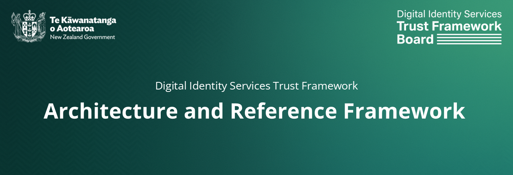

# New Zealand Digital Identity Services Trust Framework

The [Digital Identity Services Trust Framework Act 2023](https://legislation.govt.nz/act/public/2023/0013/latest/LMS459583.html) establishes the legislative framework for *"the provision of secure and trusted digital identity services for individuals and organisations"* in Aotearoa New Zealand. 

While the legislation, and its associated regulations and rules, established a legal framework, there is a need for clear guidance to establish the architectural, business and technological processes to enable participants, regulated and not, private sector or public, to participate and to jointly create the type of ecosystem envisioned by the legislation.

## An Architecture and Reference Framework

*Rationale and what's included*

## Contents

- Architecture and Reference Framework
- Digital Identity in New Zealand: A Brief Overview (White Paper)
- DISTF Rules
- Annexes
- Use Cases

## Contributing

Please read the guidance for contributing or provide feedback directly to distf@dia.govt.nz

## Versioning

*To be determined*

## Authors

Contributions to this document have been numerous. Thank you to all have provided your words, expertise, and knowledge.

## Licence

Crown Copyright 2025

## Links

- [Digital Identity Services Trust Framework](https://www.dia.govt.nz/trust-framework)
