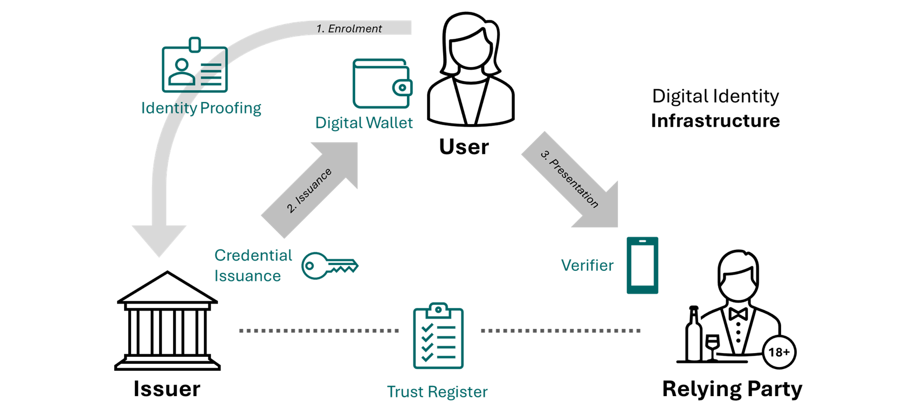

# New Zealand Digital Identity Services Trust Framework

## 1 Introduction

### 1.1 Context

In 2023 the New Zealand Parliament passed the [Digital Identity Services Trust Framework Act 2023](https://legislation.govt.nz/act/public/2023/0013/latest/LMS459583.html) (herein, the Act). The purpose of the Act, was to "establish a legal framework for the provision of secure and trusted digital identity services for individuals and organisations".

Following the passage of the Act, the Prime Minister designated the Department of Internal Affairs to host two of the statutory entities created by the Act: the Trust Framework Board and the Trust Framework Authority. Since 2023, those statutory entities have developed the accreditation processes, including the regulations and rules, and the Trust Framework Authority can now accredited providers and the digital identity services they provide.

### 1.2 Purpose

The Act, together with its secondary legislation, lays down the requirements for a modern digital identity ecosystem in Aotearoa New Zealand. These instruments explain the *what* and *why*, but they do not spell out *how* to put those requirements into practice.

The *how* is the role of this **Reference Architecture**. It sets out the practical blueprint for operating a contemporary digital identity ecosystem in New Zealand and offers guidance to every participant, not just the providers and services accredited under the Trust Framework. By aligning with international standards, it also promotes cross-border interoperability, allowing New Zealand’s digital identity services to work seamlessly with those of other jurisdictions. This is crucial for a nation that relies on trade, tourism and the global mobility of its people.

### 1.3 Definitions

The definitions in this document can be found in [Annex 1: Definitions](annexes/Annex-1-Definitions.md).

### 1.4 Scope

This reference architecture will cover the technical and operational design of New Zealand’s digital identity ecosystem under the Trust Framework.

This includes architecture principles, key components and roles, data flows for identity verification and credential issuance, trust and governance mechanisms (such as trust lists), security and privacy controls (consistent with Trust Framework rules), and clarity in the New Zealand context for the use of international standards. 

This architecture will illustrate how a user obtains a digital credential, stores it in a wallet, and presents it to a relying party, with all the trust and compliance steps in between, following models already demonstrated in comparible jurisdictions like the European Union and Australia.

This document will serve as a guide for implementers (both government and private sector) on how to build or align their systems in accordance with the Trust Framework. Importantly, it will be a reference architecture, not a detailed solution design for a single application. It will provide templates and guidelines that various providers can adopt to ensure interoperability. In addition, the reference architecture will support multiple implementation models and methods and is designed to balance flexibility with interoperability.

While the reference architecture will be drafted on the basis of the existing legislative settings, and reference those requirements, it will also provide an opportunity to feed in to future legislative amendments, notably the rules development, to ensure issues raised through the development of the reference architecture can be addressed. 

We also expect questions to be raised through the combined work on this reference architecture that may lead into later legislative change.

The architecture will be built to be technology-agnostic to an extent (while leveraging open standards) so it remains valid even as technologies evolve.

Interoperability with external systems (EU, Australia) is a guiding constraint – e.g., if Australia mandates certain standards for their wallet, we assume our Trust Framework should consider compatible standards where applicable.

**Out of Scope:** To keep the effort focused and avoid conflicts with other regimes, certain areas are explicitly excluded or will only be touched on at a high level. The architecture will not design or dictate specifics of overlapping schemes such as federated identity systems, payment systems, financial transaction networks, consumer data rights, or broader data-sharing initiatives that have their own frameworks. 

For example, while the digital identity system may be used to authenticate into a payment service, the architecture will not specify how payments are processed. Similarly, privacy regulations (like the Privacy Act) set requirements that our identity system must comply with, but the architecture will not redefine those rules – it will assume compliance and reference those obligations without recreating them. 

Lastly, detailed implementation choices (specific vendor products or programming frameworks) are not prescribed in a reference architecture, giving implementers flexibility as long as they meet the architectural requirements and standards. 

### 1.5 Disclaimers

Where there are discrepancies or contradictions, the following is the order of precedence of documents.

-  Privacy Act 2020 (as per DISTF Act, s17)
-  Digital Identity Services Trust Framework Act 2023
-  Digital Identity Services Trust Framework Regulations 2024
-  Digital Identity Services Trust Framework Rules 2025
-  Digital Identity Services Trust Framework Reference Architecture (this document)

>[!NOTE]
>This reference architecture is not a legal instrument and is provided only as guidance.

### 1.6 Change log

`0.1` - An initial outline of the proposed reference architecture drafted by the Department of Internal Affairs.

## 2 New Zealand Digital Identity Ecosystem

### 2.1 Introduction

### 2.2 Ecosystem Design

The ecosystem envisioned under the Digital Identity Services Trust Framework replicates the widely known "trust triangle" comprising issuer, holder, verifier often described in the design of self-sovereign identity. The Trust Framework breaks these roles down slightly further, for instance splitting the verifier (the technology that receives a presentation and cryptographically verifies the data) from the relying party (the natural or legal person receiving the information for a given purpose).

The above diagram serves as the basic model. It is not definitive.

**User**: A person that holds credentials. Specifically, the Act defines a user as "an individual who shares personal or organisational information, in a transaction with a relying party [...] and does so for themselves or on behalf of another individual or an organisation."

**Digital Wallet**: A piece of software, in the control of the user, that permits the issuance, holding, and presentation of digital credentials. Under the DISTF, a digital wallet isn't specifically defined, but generally would be an on-device app that culminates a:
-  Facilitation Service [(3.6)](#36-facilitation-services); and a
-  Authentication Service [(3.5)](#35-authentication-services).

**Enrolment/Identity Proofing**: Identity proofing is the process whereby a participant (in this instance, an issuer) collects, validates, and verifies information about a person.

**Issuer**: The term *issuer* is commonly used to refer to the ecosystem participant who *issues* a digital credential. Under the DISTF, an issuer isn't specifically defined, but generally is considered the culmination of three distinct services that may be provided by one or more participants:
-    Information Service [(3.2)](#32-information-services)
-    Binding Service [(3.3)](#33-binding-services)
-    Credential Service [(3.4)](#34-credential-services)

**Presentation**: the process of a user providing information to a relying party through the presentation of information encoded in a way that allows for a process of cryptographic verification. Presentation is broadly categoried into in-person/proximity or online/remote presentation.

**Relying Party**: the participant who *relies* on the information asserted by an issuer and presented by a user.

**Verifier**: the technological means by which a relying party receives and verifies information from a presentartion. A verifier might be an app, standalone hardware, embedded into existing hardware (an eftpos terminal or POS kisosk), or a website.

**Trust Register**: a publicly available register of accredited services under the DISTF that also contains the necessary cryptographic keys for participants to ensure the validity of an accredited or trusted service (whether credential, issuer, wallet, or verifier).

We break the design of the ecosystem into [3. Ecosystem Roles](#3-ecosystem-roles) and [4. Ecosystem Flows](#4-ecosystem-flows)

### 2.3 Te ao Māori Approaches to Identity

The Te Ao Māori approach to identity is holistic, collective, and deeply interconnected with whakapapa (genealogy), whenua (land), and whanaungatanga (relationships). Identity in Te Ao Māori is not simply about individual attributes; it reflects a person's connection to their ancestors, their iwi and hapū, and the land from which they originate. This worldview positions identity as relational and inherently collective, with individuals seen as custodians rather than sole owners of personal data, which is viewed as taonga; a treasure deserving careful stewardship.

Incorporating these principles into New Zealand’s digital identity ecosystem means actively upholding Māori sovereignty and enabling tino rangatiratanga (self-determination). This involves ensuring Māori communities have genuine control over their own data (recognising data as taonga) and are empowered to decide how their identity information is collected, managed, and shared. Practices should include designing digital identity solutions in genuine partnership with Māori, embedding culturally responsive processes, and respecting iwi and hapū governance structures.

Furthermore, embedding Te Ao Māori principles in digital identity can enhance trust and inclusivity across the wider ecosystem. Acknowledging data sovereignty, prioritising transparency, and promoting active consent align with broader digital identity principles such as user-centricity, privacy, and self-sovereignty. Ultimately, integrating Māori values into New Zealand’s digital identity ecosystem presents an opportunity not just to uphold Māori approaches to identity, but to ensure the best possible practice for all users.

These considerations are embedded into the Digital Identity Services Trust Framework legislation, including requirements for:
* the Trust Framework to incorporate te ao Māori approaches to identity (DISTF Act, s3)
*  the Crown to give effect to the principles of te Tiriti o Waitangi/the Treaty of Waitangi (DISTF Act, s9);
*  the Trust Framework Board to consult with tikanga experts with knowledge of te ao Māori approaches to identity in the development of rules (DISTF Act, s21);
*  the Trust Framework Board to include representation from people who have expert knowledge on both te Tiriti and in engaging with Māori (DISTF Act, s47);
*  the establishment of a Māori Advisory Group to provide advice to the Trust Framework Board (DISTF Act, s53);
*  the Trust Framework Authority to be guided by principles of tikanga Māori in handling complains (DISTF Act, s68);
*  *to continue*

### 2.5 Use Cases

Use cases play a vital role in the development of modern digital identity services, both in New Zealand and internationally. 

Firstly, they offer tangible narratives that allow everyone, technical or otherwise, to clearly understand the practical outcomes these services enable. For example, instead of explaining that "digital credentials can be presented to a relying party and cryptographically verified," it is easier to grasp when described as "using your driver licence on your phone to prove your eligibility to drive when hiring a car, either online or in person." 

Secondly, use cases assist in identifying and implementing the necessary components of a functioning digital identity ecosystem. Determining the data attributes required for a credential becomes simpler when clearly envisioning how it will be practically used. 

Lastly, use cases are not exhaustive; rather, they illustrate possibilities. Demonstrating how someone could prove online they are over 18 to buy age-restricted goods can readily translate into other identity verifications suited to different contexts. Participants can thus expand upon these indicative scenarios according to their specific needs.

#### 2.5.1 Overview

#### 2.5.2 In person age verification

#### 2.5.3 Mobile Driver Licence

#### 2.5.4 Online customer due diligence

#### 2.5.5 Caregiver holding minor's vaccination records

#### 2.5.6 Other use cases

## 3 Ecosystem Roles

### 3.1 Overview

### 3.2 Users

### 3.2 Information Services

### 3.3 Binding Services

#### 3.3.1 Biometric Matching

### 3.4 Credential Services

#### 3.4.1 All of Government Credential Issuance Service

### 3.5 Authentication Services

>[!NOTE]
>The following section on authentication services was drafted as an indication of the type of content we expect to develop for this reference architecture. It's inclusion at launch shouldn't be taken as an indication it holds some higher priority or isn't meant for consultation and collaboration.

An **authentication service** is a digital identity service that enables a person to use an **[authenticator](#351-authenticators)** to access a service.

Importantly, an authentication service requires both:
- use of one or more authenticators; and
- management of the authenticator lifecycle.

For example, an authentication service might utilise a PIN code as the **authenticator** to restrict access to a digital wallet. But the service, in managing the authenticator lifecycle, also needs to consider and manage factors like:
-   how often the PIN code needs to be changed; 
- the minimum length and complexity of the PIN code; 
- how to manage repeated incorrect attempts at the PIN code; and
- ensuring the user is aware of their responsibilities in regard to managing the authenticator.

For implementation advice for an authentication service, refer to the [New Zealand Identification Standards: Implementing the Authentication Assurance Standard](https://www.digital.govt.nz/standards-and-guidance/identity/identification-management/guidance/implementing-the-authentication-assurance-standard).

#### 3.5.1 Authenticators

The DISTF Rules define an authenticator as:

**Authenticator** means information or another thing, for example a password, a personal identification number, or a fingerprint, that-
-  is known to, or possessed or controlled by, a person; and
-  is bound or otherwise linked to the person during an interaction with a service; and
-  can be used by the person during subsequent interactions with the service to prove that they are the same person.

The [New Zealand Identification Standards](https://www.digital.govt.nz/standards-and-guidance/identity/identification-management/guidance/guide-to-authenticator-types) classify authenticators into three groups:

-  **Knowledge factor**: something you know. Examples include a password, a PIN code, or a shared secret.
-  **Possession factor**: something you possess. Examples include a credential, a passkey, or a one-time code generator.
-  **Biometric factor**: something you are or do. Examples include facial, fingerprint, or iris recognition.

The choice of authentication service (and its authenticators) is an important design consideration for a facilitation service (for instance, digital wallet) given the level of assurance it provides to both credential services issuing credentials, and to relying parties needing to trust that the user of the credential is the person the credential was issued to.

>**Example: Online Age Verification**
>
> An online gambling website wants to restrict access to users over the age of 18. To do this, it implements online age verification, allowing users to present accredited digital credentials as evidence of age.
>
>The website accepts the remote presentation of any accredited digital credential that can demonstrate age eligibility. However, the website will need to consider the strength of the authenticator of the wallet/credential given the presentation is being made remotely.
>
>- **Accept knowledge based authenticators**  
  This option provides *some* assurance that the credential belongs to the user. However, it is vulnerable to misuse such as a teenager accessing a parent's wallet using a known PIN.
>
>- **Require biometric based authenticators**  
  This provides *strong* assurance that the credential is being presented by the legitimate user, as biometric methods like fingerprint or facial recognition are difficult to fake. However, not all wallets or devices support biometrics, which may limit accessibility and multiple biometrics may be enrolled in the device.
>
>- **Independently match biometric data**  
  The website could request the credential’s portrait during presentation and independently verify it using a real-time online biometric confirmation (e.g., facial match). This provides *very strong* assurance but involves significant technical and privacy overhead, and may create barriers and resistance for users.
>
>Ultimately, the website must balance its regulatory obligations with usability and inclusion, selecting an approach that provides sufficient assurance without unduly excluding legitimate users.

##### 3.5.1.1 Platform authenticators

Platform authenticators, also known as on-device authenticators or native device authenticators, are authenticators that live on a user's device - e.g. iOS ([Local Authentication](https://developer.apple.com/documentation/localauthentication)), Android ([BiometricPrompt](https://developer.android.com/identity/sign-in/biometric-auth)), and Windows ([Windows Hello](https://learn.microsoft.com/en-us/windows/apps/develop/security/windows-hello)). These platform authenticators generally support to categories of authenticator: knowledge-based (PIN, password, or pattern) and biometrics.[^1] 

Authentication services should consider utilising these platform authenticators. The benefits of the authenticators include:
- users already use and have these authenticators configured; 
- existing well-established security and privacy; and 
- flexibility in that knowledge based and biometric based authenticators are available.

Importantly, incorporation of these robust authenticators is generally easier than developing bespoke authenticators.

> [!WARNING]
>In designing an authentication service, providers must weigh whether to support devices that lack biometric authentication. 
> 
>Removing support for older or more-affordable handsets that don't support biometric authenticators could deepen digital exclusion, yet devices restricted to knowledge-based authenticators cannot give relying parties the same confidence that the person authorising a remote presentation is the genuine user.

[^1]: Technically, these devices also support possession factor authenticators in the form of passkeys and other stored cryptographic keys. However, access to these possession based authenticators is generally further restricted behind a biometric or knowledge factor authenticator making purely possession based authenticators less relevant in this context.

##### 3.5.1.2 Passkeys (FIDO2/WebAuthn)

**Passkeys** are a type of [FIDO2](https://fidoalliance.org/fido2/)-based authentication mechanism that allow a person to strongly authenticate to a relying party (e.g. a website or app) without using a password. A passkey is a cryptographic key pair stored on a user’s device (and potentially synchronised across their devices), protected by a local unlock method, typically a platform authenticator (whether biometric or knowledge based).

Passkeys offer:
- **Strong, phishing-resistant authentication**  
- **Usability across devices and platforms**  
- **Simplified sign-in experiences** for users  

Under the DISTF, **passkeys are considered authenticators**, not credentials. While they provide high-assurance proof that the person is in control of a device and is the same person previously registered with the relying party, they do not meet the definition of a **credential** under the Trust Framework as they do not contain "bound personal or organisational information".

However, passkeys are a **modern, strong authenticator** within the ecosystem, and may be used by authentication services to secure user access.

Participants in the ecosystem should consider the place and role of both digital credentials and passkeys. This is of particular relavance to relying parties, who may only need one-time verification of certain attributes (for instance, evidence of age, driving privledges) but need repeatable access to a website, portal or system. The example below provides a demonstration of how digital credentials and passkeys can work side-by-side.

> **Example: Digital Credentials and Passkeys for Seamless and Trusted Access**
>
> A user wants to register with an **online rental car company** and expect to need to login often. The company must ensure that only individuals with a valid driver licence are permitted to book vehicles. To meet this requirement and offer a streamlined experience, the rental car company uses both **credentials** and **passkeys**.
>
> **Step 1: First-Time Enrolment – Presenting Evidence of Eligibility to Drive**
>
>The user visits the rental car website for the first time and is prompted to prove they are eligible to drive:
>
>1. The website requests **evidence of driving eligibility**.
>2. The user presents a **digital driver licence credential**, issued by an accredited provider, which contains attributes such as family name, given name, date of birth, driving privledges and credential expiry.
>3. The platform verifies the **authenticity** of the credential and that the licence has not expired or been revoked.
>4. The platform registers the user and invites them to create a **passkey** for future logins.
>
>In this step the **digital credential** provided authoritative evidence of eligibility to drive, while the **passkey** is created and securely linked to the user’s account for future access to the relying party website.
>
>**Step 2: Ongoing Authentication – Using a Passkey**
>
>For future bookings, the user signs in using only their **passkey**:
>
>1. The user opens the rental car platform.
>2. Their device presents the **stored passkey**.
>3. The user unlocks the device (e.g. Face ID, fingerprint, or device PIN).
>4. The platform authenticates the user and grants access—**no need to re-present their driving credential**.
>
>In this step, **authentication** is handled by the passkey, while **authorisation** (eligibility to drive) was previously verified and is retained in the user’s account status.
>
> **Note:** This flow separates *authentication* (proving you are the same person) from *credential presentation* (proving something about you), enabling efficient and privacy-preserving access to services that require verified attributes.
>
>**Benefits:**
>- **Regulatory compliance** with driving eligibility requirements.
>- **Streamlined user experience** with fast, passwordless sign-in.
>- **High assurance** through strong authentication and verified claims.
>- **Privacy protection** by minimising repeated disclosure of personal data.

For further information about passkeys, refer to:
- [FIDO Alliance – Passkeys](https://fidoalliance.org/passkeys/)
- [Passkeys.dev – A Developer Guide](https://www.passkeys.dev/)
- [WebAuthn Specification (W3C)](https://www.w3.org/TR/webauthn-3/)

##### 3.5.1.3 Digital credentials as authenticators

Credentials themselves can be used as authenticators given they possess all the requirements necessary for a high assurance authenticator. They are especially useful when authentication is required infrequently (and therefore a seperate authenticator is redundant), or when attributes need to be reasserted or reverified (for instance assuring a licence is still valid).

> **Example: Using a Digital Credential for Ongoing Authentication**
>
>A user wants to access services with their **national transport agency’s website** (e.g. renewing their registration, updating their address). Rather than using a password or passkey, the transport agency supports direct login via a **mobile driver licence (mDL)** they issue and accredited under the Trust Framework.
>
> **Step 1: First-Time Login – Authenticating with a Digital Credential**
>
>1. The user visits the transport agency website and chooses to "Sign in with mDL".
>2. The website requests the user's **digital driver licence**, presented remotely from their digital wallet.
>3. The transport agency verifies the **authenticity** of of the credential and then matches the driver licence number against its system of record.
>
>The user is successfully logged in. No password required.
>
> **Step 2: Subsequent Logins – Re-using the Digital Credential**
>
>Each time the user logs in they repeat the same process as in Step 1.
>
>There is **no separate authentication mechanism** required. The digital credential serves as both *authentication* and *attribute evidence* each time.
>
> **Note:** In this model, the **digital credential acts as the authenticator** for the relying party, with wallet/device-based authenticators themselves ensuring the credential is only presented by its rightful holder.
>
>**Benefits:**
>- **High assurance** authentication using an accredited, trusted credential
>- **Reduced account management** (no need for passwords or separate usernames)
>- **Up-to-date attributes** from a trusted source each time (e.g. new address or licence expiry)
>- **User-controlled and privacy-preserving**, as only the necessary attributes are shared

In summary, consider **digital credentials + passkeys** when users return frequently and the relying party doesn’t need to re-verify the attributes or credential status each time. Consider using **digital credentials only** as an authenticator when users interact infrequently and/or attribute verification or credential status is required at each session.

#### 3.5.4 Authentication requirements under the DISTF

Set this out

### 3.6 Facilitation Services

#### 3.6.1 The Government App/Digital Wallet

The Department of Internal Affairs has begun work on an app that will improve the way New Zealanders interact with government. The government app will provide a:

- secure way for agencies to communicate with New Zealanders
- safe digital wallet to hold accredited digital credentials 
- direct way to access government services and make payments.

- The app will prioritise usability, security and privacy for all users and will always be optional to use.

The app will hold digital credentials accredited under the Digital Identity Services Trust Framework. This will include credentials from government agencies and accredited private sector providers – for example, a digital driver’s licence.

The app will seek accreditation under the DISTF as an [authentication service](#35-authentication-services) and as a [facilitation service](#36-facilitation-services).

As such, it is expected that the Government App, and its digital wallet functionality, will play an important role in the development of New Zealand's digital identity ecosystem.

Follow progress on the Government App programme on [digital.govt.nz](https://www.digital.govt.nz/digital-government/programmes-and-projects/government-app-programme)

> [!NOTE]
> The introduction of an accredited digital wallet by the government *does not* preclude the ability for other digital wallet providers to enter the market, seek accreditation, and hold accredited credentials including those issued by government.

#### 3.6.2 OEM Wallets

#### 3.6.3 Digital Secure Payments

*outside scope of DISTF and reference architecture, but not at odds - i.e. a digital wallet accredited under the DISTF could also contain secure payments*

### 3.7 Verification Services

#### 3.7.1 NZ Verify

#### 3.7.2 Reader Authentication

### 3.8 Relying Parties

#### 3.8.1 Privacy Act 2020

#### 3.8.2 Other regulatory regimes impacting relying parties

### 3.9 Other Digital Identity Services

#### 3.9.1 Trust Registers

#### 3.9.2 Exchange/Identity Provider Services

#### 3.9.3 Identity Providers

## 4 Ecosystem Flows

### 4.1 DISTF Principles

### 4.2 Identity Proofing/Enrolment

#### 4.2.1 Identity Check

#### 4.2.2 Stand-alone Information (and Binding) Services

### 4.3 Credential Issuance

#### 4.3.1 Number of active credentials

### 4.4 Presentation

> :grey_question: Currently, the DISTF Rules require specific and unique authorisation by the user for every presentation. It is conceivable that there may be use cases where pre-authorisation could be useful, for instance where a user repeats the same presentation to the same verifier for the same attributes on a frequent basis. For instance, providing evidence of age at a frequently visited retailer. 
> 
> Feedback is welcome on what these use cases might be, whether a change to allow preauthorisation would be welcome, and consideration on how to balance the need for user control (exercised through explicit authorisation) with user convenience.

#### 4.4.1 In person (proximity) presentation

##### 4.4.1.1 Flash pass presentation

#### 4.4.1.2 Unattended proximity presentation

#### 4.4.2 Online (remote) presentation

##### 4.4.2.1 Same Device Flow

##### 4.4.2.2 Cross Device Flow

#### 4.4.3 Intent to Retain

#### 4.4.4 Status/Revocation

### 4.5 Other processes

#### 4.5.1 Revocation of credentials

## 5 Data and attribute standards

### 5.1 Data and attributes

### 5.2 Mandated data standards

### 5.3 New Zealand-specific namespaces and attributes

#### 5.3.1 Austroads-specific namespace

## 6 Trust Model

### 6.1 Scope

*Need to insert a diagram here replicating the triangle of trust and noting how each actor gains trust etc.*

### 6.2 Accreditation

#### 6.2.1 Overview

#### 6.2.2 Provider Accreditation

#### 6.2.3 Information Management Assessment

#### 6.2.4 Privacy Assessment

#### 6.2.5 Security Assessment

#### 6.2.6 Ongoing Requirements

### 6.3 Trust Register

### 6.4 Levels of Assurance

#### 6.4.1 Regulatory Assurance Levels

#### 6.4.2 New Zealand Identification Standards Levels of Assurance

### 6.4 Trusted Issuers

#### 6.4.1 Issuers as Credential Services

#### 6.4.2 Issuers as standalone information (and binding) services

### 6.5 Trusted Users

### 6.6 Trusted Facilitation Services

### 6.7 Trusted Verifiers and Relying Parties

## 7 International

### 7.1 Overview

### 7.2 Technical Interoperability

### 7.3 Mutual Recognition

### 7.4 Equivalency

### 7.5 Digital Travel Credentials

## 8 Annexes
