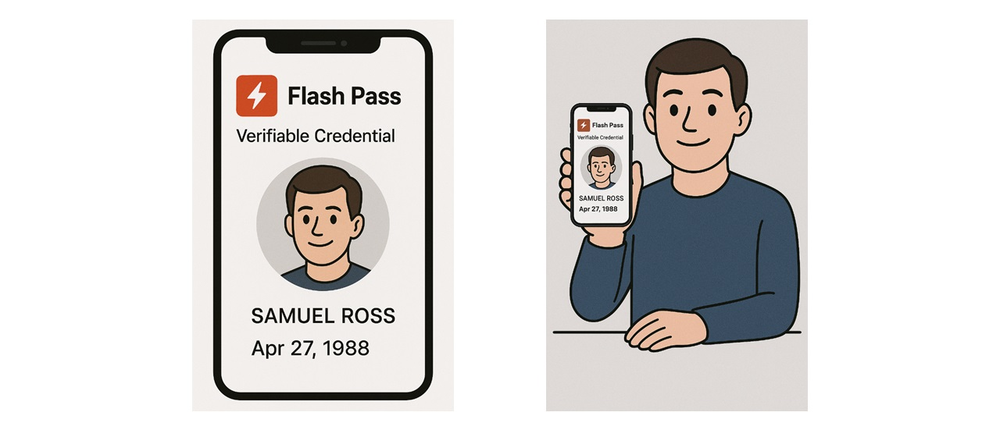
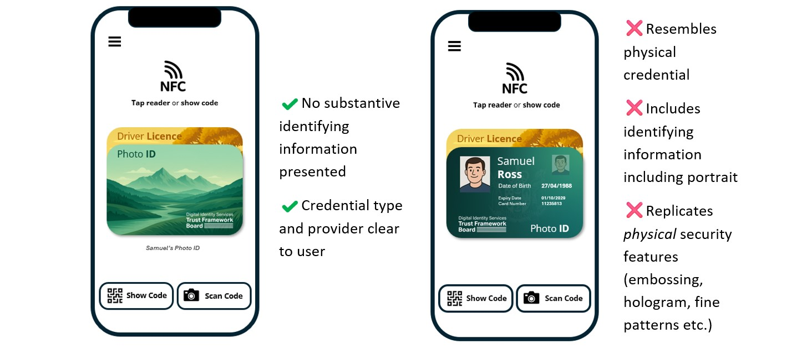
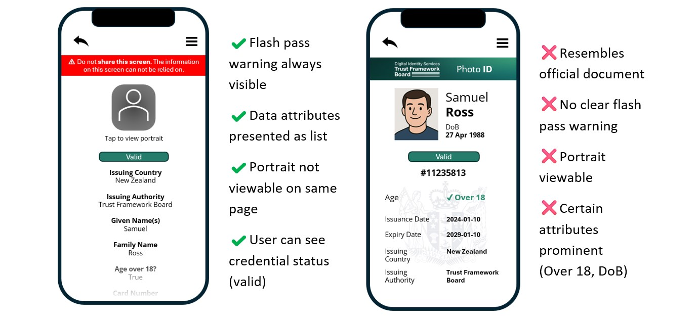

*4 August 2025*

# Guidance: Safe Use of “Flash Pass” Presentation

## Purpose

This document provides guidance to Facilitation Service providers, Users and Relying Parties on the safe use of "flash pass" credential presentations.
The objectives of this guidance are to:
-  Inform audiences what flash pass credential presentations are.
-  Affirm the individual's right to access and view their personal credential information.
-  Maintain the integrity and trust model of verifiable credentials.
-  Mitigate risks associated with informal or unverified credential presentation.
-  Promote safe and consistent use of verifiable credentials in New Zealand.

## Background
Flash pass credential presentation refers to a method of credential presentation for in-person usecases which involves the visual, human-readable display of credential information, such as a name, photo, date of birth, or entitlement, directly on thefrom the screen of aa holders device. This method of presentation does not involve cryptographic verification of the credential or the issuer on a separate verification device, meaning there is no automated or technical validation that the credential is genuine, current, or has not been tampered with. It is similar in nature to visually displaying a physical card or document but in a digital formatbut in a digital format.

Flash pass presentations are commonly used for quick, low-friction interactions where formal verification is not required, such as showing a digital membership card, a loyalty program credential, or age-related entitlements in low-risk scenarios. However, reliance on this form of presentation carries inherent risks, particularly where the credential is used to access sensitive services, establish identity, or make trust-based decisions. Because there is no cryptographic proof, there is no guarantee that the information being presented is authentic or that it has not been altered from issuance.

The Digital Identity Services Trust Framework Rules 2024 discourage the use of flash pass credential presentations. These rules emphasise the importance of using verifiable credential presentations that leverage cryptographic mechanisms to ensure the credential’s validity and provenance.

While flash pass presentations can support user control and ease of access, they should not be relied upon as the sole method of credential verification in high-assurance or security-sensitive contexts. This guidance aims to promote informed decision-making regarding the appropriate and safe use of flash pass presentations within the New Zealand digital identity ecosystem.

## Example of “Flash Pass” Credential Presentations

*Image 1: Flass pass example on device.*

*Image 2: Example of person presenting flash pass credential.*
 
## Guidance for Facilitation Services

### 1. User Visibility of Credential Information
Facilitation services should allow credential holders to view their personal information contained within credentials issued to them. However, This this should be provided in a format clearly intended for personal reference only, not as proof for third parties.

### 2. Distinction Between Viewing and Presenting
Facilitation services should consider implementing a clear distinction between:
-  Viewing: where the user accesses their own data for personal purposes.
-  Presenting: where the user shares their data with a third party for verification.
Static visual displays (such as showing a name and photo) should not be treated or presented as verifiable credentials.

### 3. Discourage Flash Pass by Design
To reduce misuse, confusion and prevent false assumptions of authenticity:
-  Do not design flash pass views to resemble official documents (e.g. driver licences or passports).
-  Label all flash pass views clearly, e.g. "Not Verified – For User Viewing Only".

### 4. Limit Use to Low-Risk Contexts
Flash pass presentation should only be made available where all the following conditions are met:
-  The credential content is low risk and non-sensitive (e.g. loyalty or membership cards).
-  The circumstance for use is informal, social, or optional in nature.
-  The relying party explicitly accepts flash pass presentation as a valid form of information display.
Use the following questions to guide whether a flash pass (i.e. visual-only) presentation should be supported in your service.

| Question | Guidance |
|----------|-----------|
| Is the credential low-risk, provides low level of binding assurance or not used for official decisions? | Flash pass may be suitable for non-sensitive credentials such as loyalty cards, event tickets, or public memberships. Do not enable for proof of identity, age, or entitlement credentials. |
| Will users expect to show this credential visually (e.g. at a venue)? | In some social or informal settings, visual display may be a user expectation. If allowed, clearly label it “Not Verified – For Viewing Only.” |
| Could flash pass presentation be mistaken for proof of identity or official entitlement? | If yes, do not enable visual presentation or ensure it is explicitly differentiated from official documents. Use clear design signals to avoid confusion. |
| Can the presentation be spoofed or falsified easily? | Flash passes can be screenshotted or faked. If this introduces risk to users or relying parties, require verified presentation methods instead. |
| Will enabling flash pass delay adoption of proper verification mechanisms? | If yes, consider disabling flash pass to reinforce relying party investment in the trust model (e.g. verifiers, apps, or scanners). Note: NZ Verify \| Whakatūturu is available to support verifying activities for some credentials. |

## 5. Prioritise Secure and Verifiable Sharing
Facilitation services should encourage users to share credentials through verified means such as QR codes, secure links, or other cryptographically backed means. Verified sharing should be the default mechanism for credential presentation. 

## 6. Examples

**Presenting** Display Examples

**Viewing** Display Examples

 
## Guidance for Users
### 1. Access to Your Data
You should have the ability to view your own credential information. However, information displayed on your screen is not inherently trustworthy to others unless it is cryptographically verified.
When something is cryptographically verified, it means it has been checked using a digital signature to prove that the information is authentic and comes from a trusted source.
### 2. Understand the Limits of Flash Pass
Flash pass presentation does not constitute proof of identity, age, or entitlement. Screenshots and digital forgeries are easily created and may mislead relying parties.
### 3. Ask Before Presenting
Before using a flash pass:
-  Confirm with the relying party whether have means to verify cryptographically (may be called a “verifier”). If not, confirm they accept screen-based presentation.
-  If formal proof is required, only use the secure sharing or verification method supported by your facilitation service.
### 4. Avoid Use in High-Risk Contexts
Do not use flash pass presentations in contexts where high trust or legal compliance is required, including:
-  Age-restricted purchases or venues.
-  Healthcare, government, or public service interactions.
-  Situations involving legal entitlements or obligations.
 
## Guidance for Relying Parties
Relying parties are organisations or individuals who receive and assess credential presentations. They play a critical role in upholding confidence in New Zealand’s digital identity ecosystem by using trusted and secure means to accept digital credentials. This guidance helps relying parties make informed decisions about when and how to accept credential presentations, particularly when flash pass (i.e. on-screen) displays are involved.

### 1. Understand the Trust Model
A verifiable credential relies on cryptographic methods to ensure that it:
-  Was issued by a trusted authority.
-  Has not been altered.
-  Belongs to the individual presenting it.
A visual display of credential data (e.g. showing a name and photo on a phone screen) lacks these assurances.
Without cryptographic verification, there is zero assurance of the authenticity or validity of a credential.

### 2. Do Not Rely on Flash Pass in High-Trust Contexts
You should not accept a flash pass as sufficient in any context where:
-  Legal or regulatory compliance is required (e.g. alcohol sales, age verification).
-  The credential grants access to entitlements, services, or benefits other than in low risk situations.
-  Identity, age, or eligibility must be proven beyond reasonable doubt.

### 3. Clearly State Accepted Forms of Credential Presentation
Make clear to users which types of credential presentation you accept.
If flash pass is acceptable, communicate this explicitly and acknowledge the associated risks.
Where possible, prefer or require cryptographically verified credentials (e.g. via QR code, secure app-to-app interaction, or NFC tap).

### 4. Assess Context, Risk, and Consequences
Use the following questions to guide your acceptance of flash pass credentials:

| Question | Guidance |
|----------|-----------|
| What are the consequences if this credential is fake? | If the risk is high (e.g. fraud, access to sensitive data), do not accept flash pass. |
| Do I know this credential came from a trusted source? | Flash pass alone cannot establish this. Only verified credentials can. |
| Can the presentation be recorded or verified after the fact? | Flash passes are ephemeral and not auditable. |
| Is this a one-time informal interaction? | Flash pass may be sufficient if consequences are minimal. Use discretion. |

### 5. Encourage Use of Verifiable Methods
-  Download and use [NZ Verify/Whakatūturu](https://www.dia.govt.nz/nzverify) where available.
-  Provide technology (e.g. scanners, verifier apps) that supports verifiable credentials.
-  Support user education by explaining why secure sharing for verifiable credentials is preferred.
-  Work with facilitation services to integrate trusted verification channels into your customer interaction systems.

### 6. Be Vigilant for Fraud Risks
-  Flash passes can be easily falsified using screenshots or image editing.
-  Train frontline staff to recognise when additional verification is needed.
-  Be cautious with documents that appear official but were not cryptographically presented.
