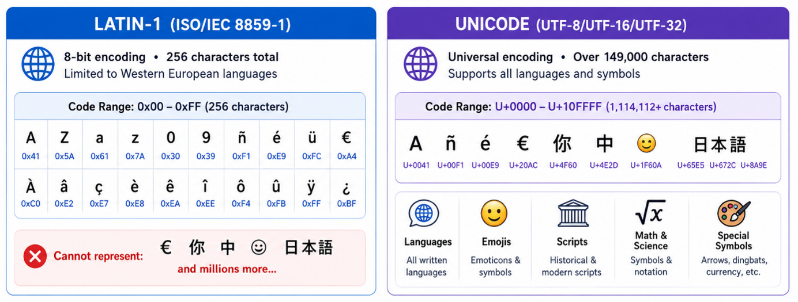

*29 June 2026*
# Guidance: Text Encoding Requirements for Credential Attributes
## Purpose and Scope

This document provides guidance on the text encoding requirements that apply to attributes within digital credentials (credential service) accredited under the Trust Framework.

It explains the new requirement for Trust Framework providers to ensure that attributes describing individuals, organisations, or places, can be created, stored, processed, and exchanged using the UTF-8 and the Latin-1 character set. Trust Framework Rule 8(2A) effective from 29 June 2026, makes these character sets a mandatory requirement.

The guidance is intended to support consistent implementation, improve interoperability across systems, and reduce the risk of data loss, corruption, or misrepresentation when credentials are issued, shared, and presented.

## Background and rationale

Rule 8(2A) addresses the need for credentials issued under the Trust Framework to accurately represent and exchange text across different systems, devices, and jurisdictions.

In practice, credentials contain names, place information, organisational details, and other text-based attributes that must remain accurate when they move between relying parties and facilitation mechanisms. Without clear encoding requirements, there is a risk that characters are lost, altered, or rendered incorrectly during creation, transfer, storage, and presentation.

This is particularly important in the New Zealand context. Accurate text encoding supports the correct representation of te reo Māori by including macrons and other diacritics used in personal names, iwi and hapū affiliations, and place names. Consistent support for these characters is important for cultural integrity, inclusivity, and trust in the digital identity system. This helps ensure that individuals and communities are represented accurately when credentials are issued and used.

Compatibility with Latin-1 is also useful where names or place information may need to be transliterated for readers or systems that do not use the original script, or for legacy systems unable to record or represent broader character sets. For example, a Greek person’s name may originally be recorded natively in Unicode (Γιώργος Παπαδόπουλος), but another reader may rely on a Latin-script rendering of that name (Giorgos Papadopoulos). Supporting a consistent Latin character set ensures transliterations are displayed and exchanged in a predictable way while preserving the importance of accurate representation in the original form.

## The requirement in practice
Under the new requirement for Rule 8(2A), a Trust Framework provider must ensure that attributes within credentials conform to the Universal Coded Character Set specified in ISO/IEC 10646. This rule aligns with ISO/IEC 23220-2 that requires all text strings to be encoded by Unicode as specified in ISO/IEC 10646.
For attributes that describe an individual, organisation, or place, providers must ensure those attributes are capable of being created, stored, processed, and exchanged using: 
*  Unicode UTF-8 as specified in ISO/IEC 10646, and
*  Latin-1 character set as specified in ISO/IEC 8859-1, and
*  Trust Framework provider must ensure that attributes within credentials are not subject to character encoding constraints that prevent the correct representation, processing, or interchange of permitted characters. 

## Implementation



Latin-1 (ISO 8859-1) maps directly onto the first 256 code points of Unicode (U+0000–U+00FF), making it a proper subset. Every Latin-1 character has an identical Unicode counterpart. Unicode, however, covers over a million code points beyond that range.

This creates a risk of compatibility issues. A verifier designed for Latin-1 only will correctly process text that falls within the first 256 Unicode code points, but it may not be able to handle characters outside that range. If it is unclear whether an attribute uses the narrower Latin-1 set or the broader Unicode set, a verifier may not be configured to process it correctly. Even where a system can technically support the broader Unicode character set, a verifier reading the attribute may still be unable to understand it if it is presented in a different non-Latin script, such as Japanese.

In practice, a provider complies with Rule 8(2A) by encoding relevant attributes in UTF-8, which supports the full Universal Coded Character Set. Where an attribute contains characters outside the Latin-1 character set (for example, macronised vowels in te reo Māori names), include an additional transliterated form of that attribute that conforms to ISO/IEC 8859-1. This ensures the attribute remains capable of exchange with systems limited to Latin-1.

Where all characters in an attribute fall within the Latin-1 repertoire (for example, "John Smith"), a single attribute encoded in UTF-8 satisfies both Rule 8(2A)(b)(i) and (ii), as the attribute can be losslessly converted to Latin-1. No separate transliterated attribute is required in this case. A transliterated companion attribute is required only where the attribute contains characters that cannot be represented in Latin-1.

Providers should apply a consistent approach. For example, if a provider supports characters in the broader Unicode character set alongside separate Latin-1 attributes, it should do so in all cases, even where a particular attribute value would also fall within the Latin-1 subset.

## Examples
> [!WARNING]
> Providers and verifiers should take care, as different standards require the same attribute names to use different character encodings. For example, as shown above, the given_name attribute is required to be encoded in Unicode under ISO/IEC 23220-2 (mobile document), whereas ISO/IEC 18013-5 (mobile driver licence) requires given_name to be encoded in Latin-1.

**Example:** a person’s name attributes that fall within the Latin-1 character set, or where a provider’s system of record only records name attributes within the Latin-1 character set.

```
org.iso.23220.photoid.1

given_name: “John”
family_name: “Smith”
```

or

```
org.iso.23220.photoid.1

given_name: “John”
given_name_latin1: “John”
family_name: “Smith”
family_name_latin1: “Smith”
```

**Example:** a place name attribute that utilises the wider Unicode character set and offers the attribute in the Latin-1 character set.

```
org.iso.23220.photoid.1

resident_city: “Taupō”
resident_city_latin1: “Taupo”
```

**Example:** a provider conforming to the DISTF requirement and ISO/IEC 18013-5 (mobile driver licence).

```
org.iso.18013.5.1

given_name: “Giorgos”
given_name_national_character: “Γιώργος”
family_name: “Papadopoulos”
family_name_national_character: “Παπαδόπουλος”
```

## Out of Scope
This requirement applies only to attributes contained within a credential accredited under the Trust Framework. It does not mandate changes to a participant’s underlying system of record, nor does it apply to attributes within other service types.

## Transliteration
Transliteration is the process of representing characters from one character set using the closest equivalent in another, such as rendering "Āroha" as "Aroha" by replacing the macron. 

Where possible, the authoritative source of an attribute should provide the transliterated form of their attribute, and that form should be used. Where there is a record of both, both attributes should be presented as demonstrated in the examples above.

Automated transliteration should be treated as the less preferable solution. Where automated transliteration is used, it should follow existing recognised systems, whether they are international standards or government issued guidance.

## URLs to ISO/IEC standards in this guidance

ISO/IEC 8859-1:1998 — Information technology — 8-bit single-byte coded graphic character sets — Part 1: Latin alphabet No. 1
https://www.iso.org/standard/28245.html

ISO/IEC 10646:2020 — Information technology — Universal coded character set (UCS)
https://www.iso.org/standard/76835.html 

ISO/IEC TS 23220-2:2026 — Cards and security devices for personal identification — Building blocks for identity management via mobile devices — Part 2: Data objects and encoding rules for generic eID systems
https://www.iso.org/standard/91155.html 
